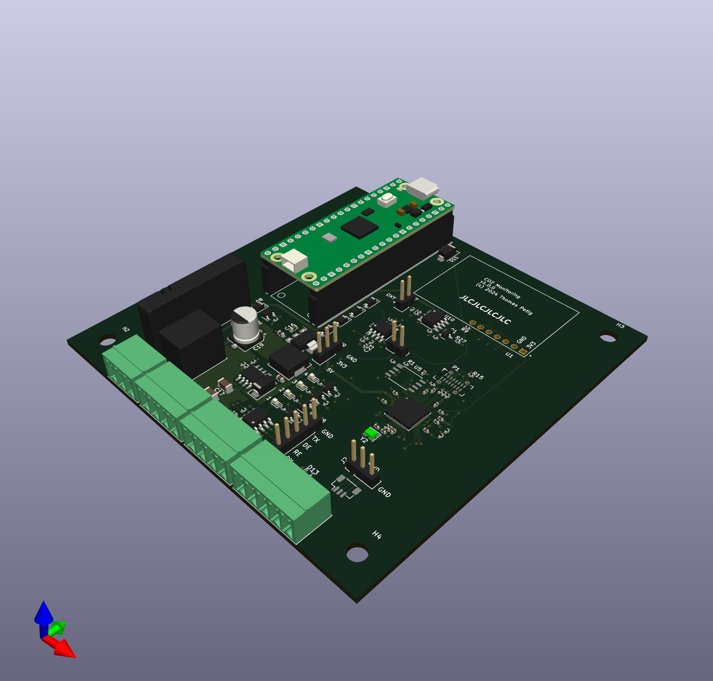

# CO2 control
Monitor for CO2
## Features
 * EIA-485 interface
 * SCD-30 sensor
 * Input volatage 24 V
 * RP-2040
 * 4 LEDs
 * Relay
 * Oxygen Cell input < 150 mV (not yet tested)
 * 0-10 V output
 * 1 wire interface

## Issues and Limitations
The following issues with the current versions are known:
 * RX/TX to SCD30 need to be switched
 * doesn't connect via USB
   * USB C symbol should have been a receptable, not plug
   * Thus, B7/B6 are not connected to D+/-

## Firmware
The [co2control-fw](https://github.com/thpe/co2control-fw) firmware samples the SCD-30 regulary and exposes the measurements via
modbus.
